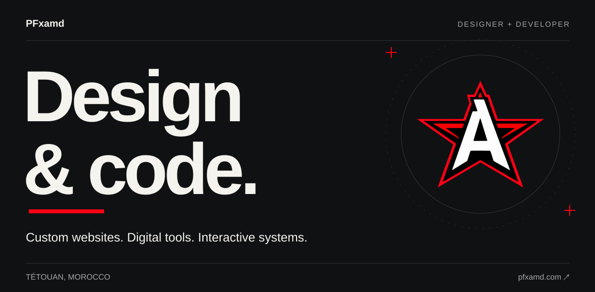
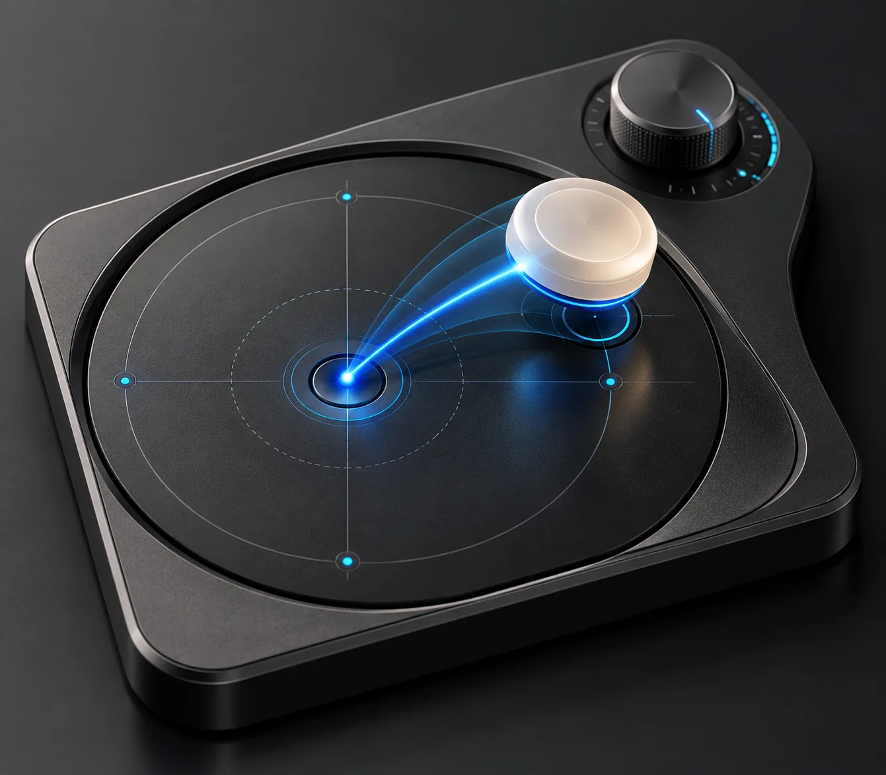
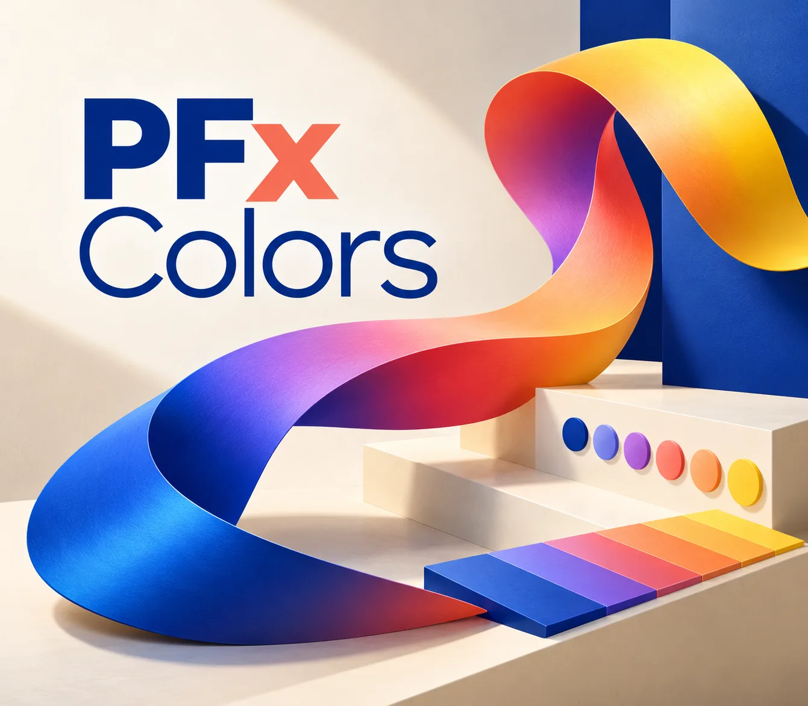
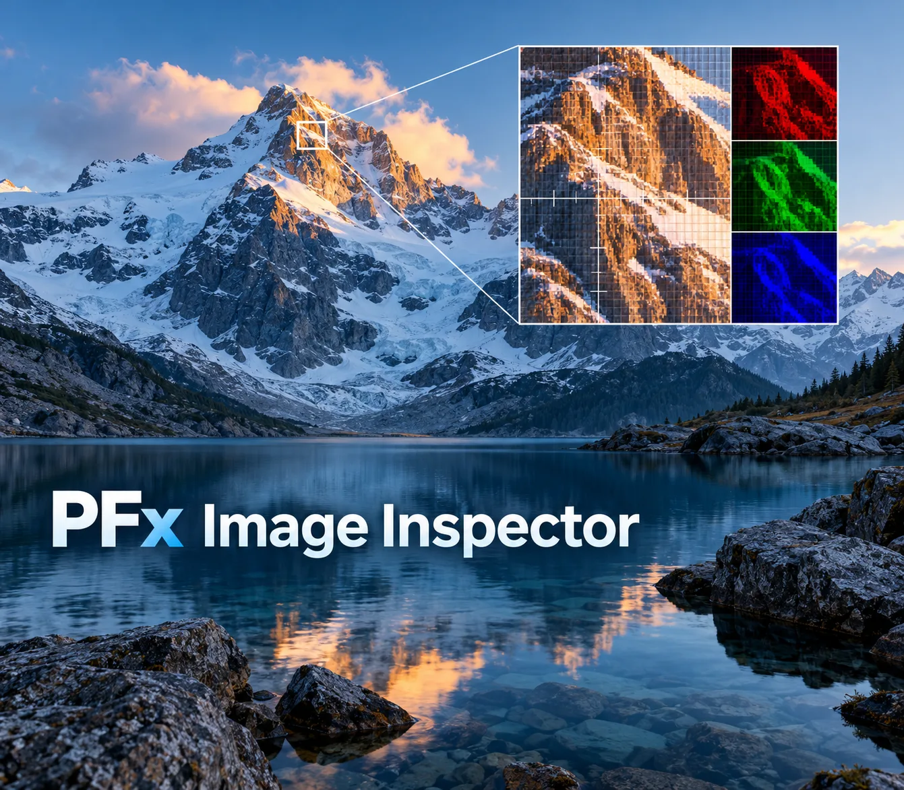
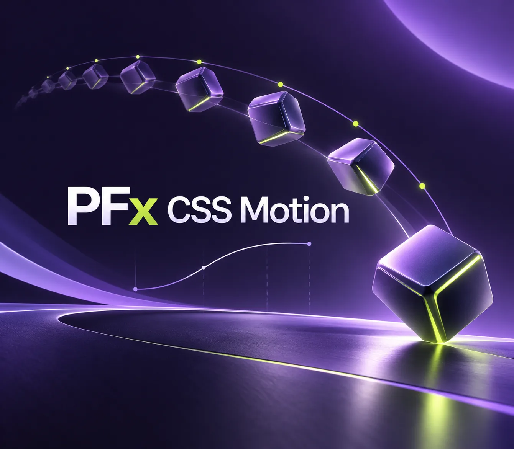

## Selected tools

Tools I design and build for the browser.

<table>
<tr>
<td width="50%" valign="top">

<h3>PFx Interaction Playground</h3>

Drag, rotate, snap and explore pointer interactions.

<a href="https://pfxamd.github.io/pfx-interaction-playground/">Open tool ↗</a> &nbsp; · &nbsp; <a href="https://github.com/pfxamd/pfx-interaction-playground">Source</a>

</td>
<td width="50%" valign="top">

<h3>PFx Colors</h3>

Explore color and build palettes.

<a href="https://pfxamd.github.io/pfx-colors/">Open tool ↗</a> &nbsp; · &nbsp; <a href="https://github.com/pfxamd/pfx-colors">Source</a>

</td>
</tr>
<tr>
<td width="50%" valign="top">

<h3>PFx Image Inspector</h3>

Inspect image properties, colors and metadata.

<a href="https://pfxamd.github.io/pfx-image-inspector/">Open tool ↗</a> &nbsp; · &nbsp; <a href="https://github.com/pfxamd/pfx-image-inspector">Source</a>

</td>
<td width="50%" valign="top">

<h3>PFx CSS Motion</h3>

Explore and compose CSS animation.

<a href="https://pfxamd.github.io/PFx-CSS-Motion/">Open tool ↗</a> &nbsp; · &nbsp; <a href="https://github.com/pfxamd/PFx-CSS-Motion">Source</a>

</td>
</tr>
</table>

[Explore all projects ↗](https://pfxamd.com/lab)

## Behind the tools

Reusable cores, developed independently from their interfaces.

| Core | Focus |
| :--- | :--- |
| [PFx Interaction Core](https://github.com/pfxamd/PFx-Interaction-Core) | Pointer input and interaction mechanics |
| [PFx Color Core](https://github.com/pfxamd/pfx-color-core) | Color operations |
| [PFx CSS Motion Core](https://github.com/pfxamd/pfx-css-motion-core) | CSS motion primitives |
| [PFx Vector Core](https://github.com/pfxamd/pfx-vector-core) | Vector operations |
| [PFx Preview Core](https://github.com/pfxamd/PFx-Preview-Core) | Responsive previews |

## Working with

**TypeScript** · **React** · **Next.js** · **Vite** · **Node.js** · **CSS**

---

**Design and development, by PFxamd.** &nbsp; [pfxamd.com ↗](https://pfxamd.com)
